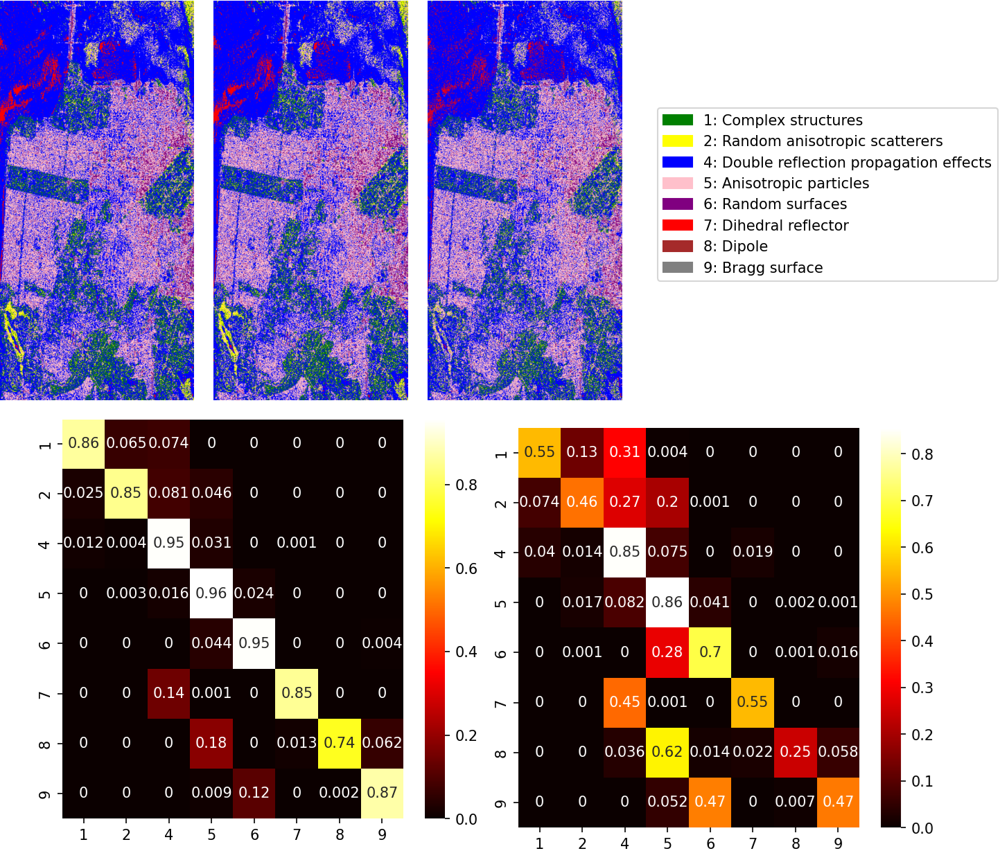

# Complex-Valued AutoEncoders for PolSAR Reconstruction

[](LICENSE)
[](https://pytorch.org/)
[cite_start][](#) Official repository for the paper: **"Exploring Polarimetric properties preservation for PolSAR image reconstruction with Complex-valued Convolutional Neural Networks"**[cite: 999].

[cite_start]**Authors:** Quentin Gabot, Joana Frontera-Pons, Jérémy Fix, Chengfang Ren, Jean-Philippe Ovarlez[cite: 1000].

---

## 📌 Abstract

[cite_start]The inherently complex-valued nature of Polarimetric SAR (PolSAR) data necessitates specialized algorithms[cite: 1009]. [cite_start]However, deep learning studies often convert complex signals into the real domain before applying conventional real-valued models[cite: 1010]. 

[cite_start]In this work, we investigate the performance of **Complex-valued Convolutional AutoEncoders (CV-CoAE)**[cite: 1011]. [cite_start]We demonstrate that these networks effectively compress and reconstruct fully polarimetric SAR data while preserving essential physical characteristics[cite: 1012]. We validate the preservation of these properties through various decompositions:
* [cite_start]**Coherent Decompositions**: Pauli, Krogager, and Cameron[cite: 1012].
* [cite_start]**Non-Coherent Decompositions**: $H-\alpha$ decomposition[cite: 1012].

[cite_start]Our findings highlight the significant advantages of Complex-Valued Neural Networks (CVNNs) over their Real-Valued counterparts (RVNNs) in preserving high-level polarimetric semantics[cite: 1013, 1102].

## 🏗️ Architecture

The models implemented in this repository are Convolutional AutoEncoders (CoAE) extended to the complex domain. They include:
* [cite_start]Complex-valued convolutions and linear layers[cite: 1208].
* [cite_start]Complex-valued activation functions (e.g., CReLU, Cardioid)[cite: 1209, 1250, 1252].
* [cite_start]Complex-valued down-sampling (strided convolutions) and up-sampling (Nearest Neighbor interpolation)[cite: 1412, 1420].
* [cite_start]Complex-valued Batch Normalization[cite: 1213, 1286].

## 💾 Datasets

This repository provides configurations to run experiments on two distinct fully polarimetric SAR datasets:

1. [cite_start]**San Francisco ALOS-2:** * **Source:** ALOS-2 (L-Band)[cite: 1376].
   * [cite_start]**Details:** Fully polarimetric (4 channels corresponding to the Sinclair matrix), $\approx$ 10m resolution[cite: 1376, 1378].
   * [cite_start]**Size:** 44,478 non-overlapping $64 \times 64$ tiles[cite: 1379].
   
2. [cite_start]**Brétigny:** * **Source:** RAMSES sensor (X-Band)[cite: 1382, 1383].
   * [cite_start]**Details:** Fully polarimetric, 1.32m $\times$ 1.38m resolution[cite: 1383].
   * [cite_start]**Size:** 1,224 non-overlapping $64 \times 64$ tiles[cite: 1384].

## 🛠️ Installation

This project uses [Poetry](https://python-poetry.org/) for dependency management.

```bash
# Clone the repository
git clone [https://github.com/QuentinGABOT/complex-valued-aes-for-polsar-reconstruction.git](https://github.com/QuentinGABOT/complex-valued-aes-for-polsar-reconstruction.git)
cd complex-valued-aes-for-polsar-reconstruction

# Install dependencies using Poetry
poetry install
```

Alternatively, you can install it using pip via the pyproject.toml:
```bash
pip install -e .
```

## 🚀 Usage

We provide configuration files (.yaml) to easily reproduce the experiments.

To train the reconstruction models, use the runner script located in the projects/reconstruction/ folder, and point it to the desired configuration file in the configs/ directory:
```bash
# Train the Complex-Valued AutoEncoder (CVNN)
poetry run python projects/reconstruction/run.py --config configs/config_reconstruction.yaml

# Train the Real-Valued AutoEncoder baseline (RVNN)
poetry run python projects/reconstruction/run.py --config configs/config_reconstruction_real.yaml
```
(Note: Adjust the data paths within the .yaml configuration files to match the location of your downloaded datasets).

## 📊 Results

Our complex-valued models (CVNN) consistently achieve lower Mean Squared Error (MSE) and better preserve physical properties (Cameron and $H-\alpha$ classifications) compared to equivalent real-valued models (RVNN).

# Quantitative Comparison (CVNN vs RVNN)

Metrics evaluated on the test set. Best results are in bold.

| Dataset | Model | MSE (↓) | PSNR (↑) | SSIM (↑) | $H-\alpha$ OA (%) (↑) | Cameron OA (%) (↑) |
|-------|-------|:----------:|:------:|:------:|:----------:|:----------:|
| ALOS-2 | AE RVNN | 2.0×10−2 | 16.91 | 0.83 | 79.07 | 61.74 |
| - | **AE CVNN (ours)** | **1.1×10−3** | **29.77** | **0.99** | **93.81** | **88.03** |
| Brétigny | AE RVNN | 2.6×10−2 | 15.77 | 0.74 | 78.76 | 60.73 |
| - | **AE CVNN (ours)** | **1.3×10−3** | **28.71** | **0.98** | **95.74** | **88.98** |

# Visual Reconstruction

The preservation of polarimetric properties is evident in the physical decompositions. Below is an example of the Cameron decomposition reconstructed by our models:


*Figure 1: Reconstruction results obtained from CVNN on the San Francisco Polarimetric SAR ALOS-2 dataset*. Up: Amplitude images of the original (left), reconstructed with a CVNN (middle), and reconstructed with an RVNN (right) with the $H-\alpha$ classification. Down: Confusion matrix of the original (rows) and reconstructed (columns) $H-\alpha$ classes with a CVNN (left), and with an RVNN (right).


## 🔗 Citation

If you use this code or our findings in your research, please cite our paper:

```bibtex
@article{gabot2026exploring,
  title={Exploring Polarimetric properties preservation for PolSAR image reconstruction with Complex-valued Convolutional Neural Networks},
  author={Gabot, Quentin and Frontera-Pons, Joana and Fix, J{\'e}r{\'e}my and Ren, Chengfang and Ovarlez, Jean-Philippe},
  journal={IET Journal},
  year={2026}
}
```

## 🙏 Acknowledgments

This work was supported by **SONDRA**, **CentraleSupélec**, **ONERA**, and **DSO National Laboratories**.
